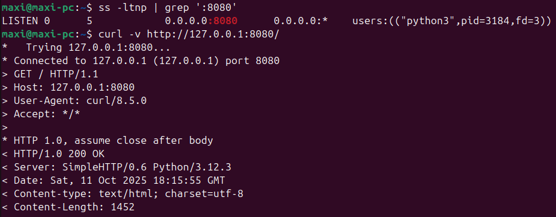
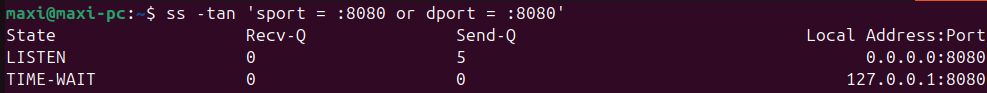
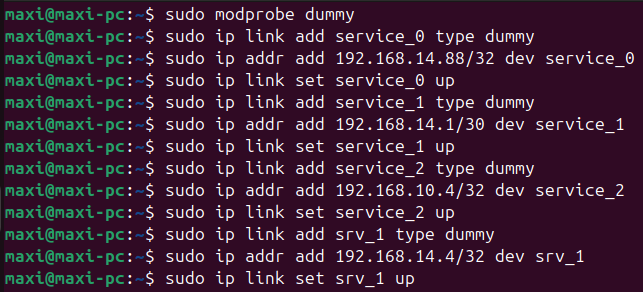
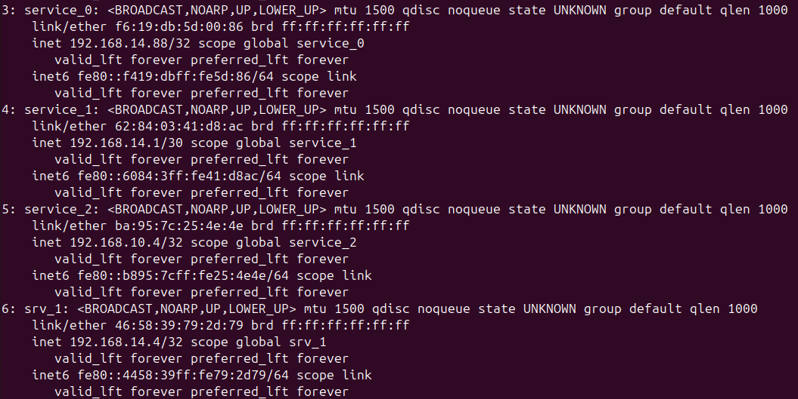
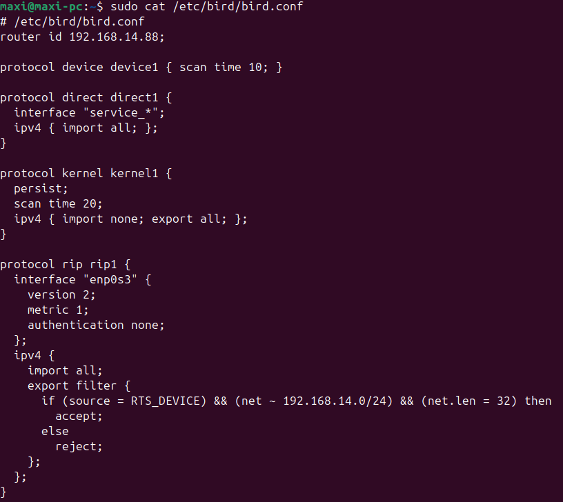
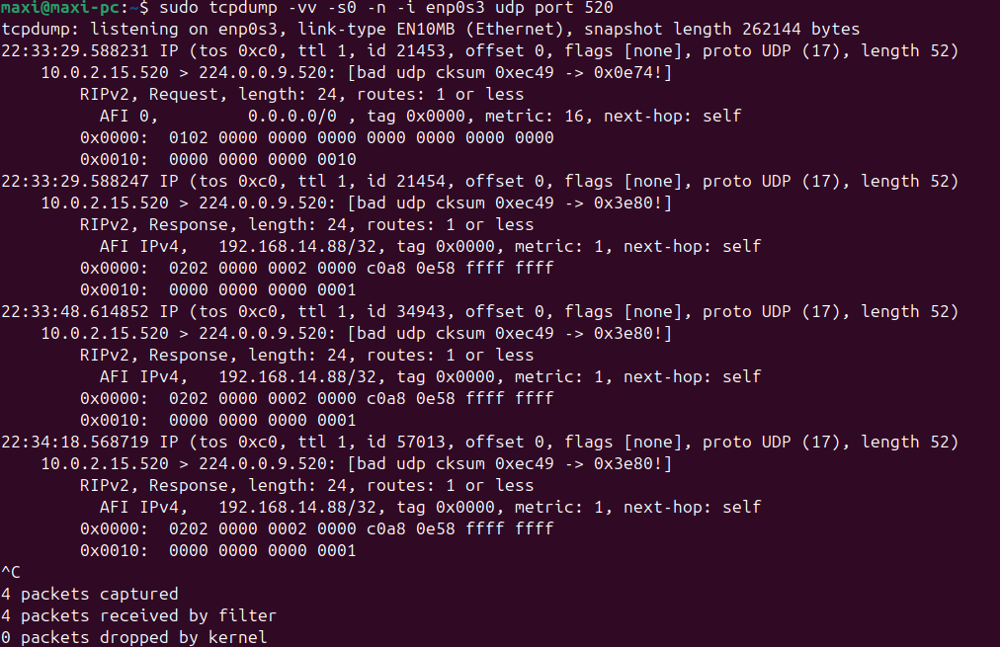
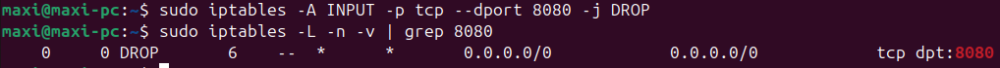
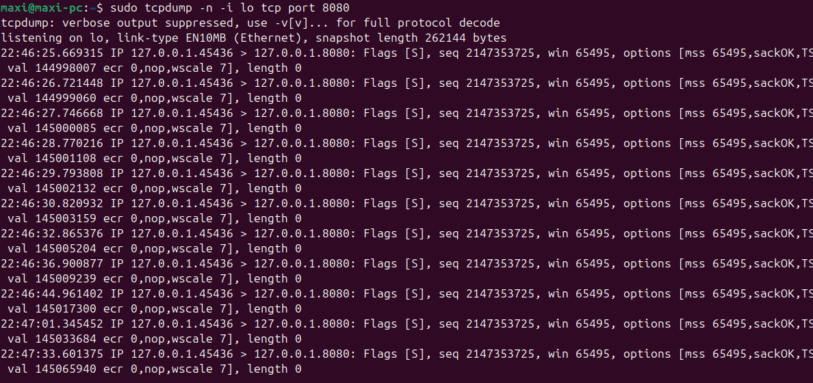
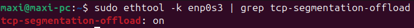

## Выполнение задания 1

После запуска Python HTTP-сервера появился LISTEN-сокет для порта 8080.

Сервер успешно принял запрос.

После выполнения запроса появился TIME-WAIT сокет - потому что сервер первым инициирует закрытие соединения (в
TCP-протоколе сторона, закрывающая соединение, обязана перейти в состояние TIME-WAIT и оставаться в нём на некоторое
время).

TIME-WAIT защищает от запоздалых пакетов (чтобы они не были восприняты как часть нового соединения, если порт/IP нового
соединения совпадут).

Большое количество TIME-WAIT сокетов может исчерпать диапазон портов, увеличить нагрузку на сервер, приводить к росту
задержек для новых соединений.

---

## Выполнение задания 2

Созданы 4 dummy-интерфейса (service_0, service_1, service_2, srv_1).

Конфигурация bird:

Анонсируется только адрес service_0, остальные - нет.

---

## Выполнение задания 3

Создание правила для firewall:

Firewall по правилу DROP отбрасывает пакеты, и запрос через curl не добирается до сервера.

---

## Выполнение задания 4

Параметр tcp-segmentation-offload включён.

TSO решает задачу аппаратного ускорения TCP - разделения сегментов на пакеты через ресурсы сетевой карты. Это снижает
нагрузку на процессор и повышает пропускную способность сервера.